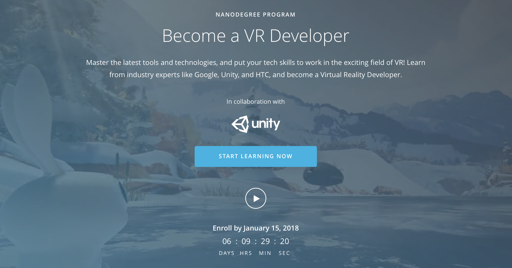

# Virtual-Reality-Nanodegree
Udacity’s Virtual Reality Nanodegree. Master the latest tools and technologies, and put your tech skills to work in the exciting field of VR! Learn from industry experts like Google, Unity, and HTC, and become a Virtual Reality Developer.

TERM 1: Foundations

Focus on the fundamentals of using the Unity Game Engine to build beautiful and performant VR scenes, and learn how to make your VR experience more dynamic and responsive by using C# programming in the Unity interface.

TERM 2: Essentials

You’ll learn the fundamentals of VR design including ergonomics, user testing, and interface design, as you establish a solid foundation to approach any VR design task. You’ll hear exclusive perspective from industry professionals about the future of VR, and start preparing for your concentration.

TERM 3: Specializations

Here is where you’re transformed from VR generalist to in-demand specialist! You’ll select one of two concentrations—Mobile Performance & 360 Media, High-Immersion Unity, or High-Immersion Unreal—and work through specialized projects on the way to your final Capstone Project!

References:  
https://www.udacity.com  
https://www.udacity.com/nanodegree  
https://www.udacity.com/course/vr-developer-nanodegree--nd017  

